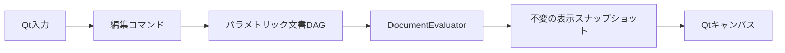

# アーキテクチャ

## データの流れ

文書DAGが正本であり、CGAL評価結果とQt表示は再生成可能な派生データとする。

`MainWindow`が`DocumentHistory`を所有し、CanvasとObjects一覧は同じ履歴を参照する。
`DocumentEvaluator`は文書からNodeId付きの全primitiveの評価スナップショットを生成する。Circleは円、RectangleとGoldenRectangleは4本の線分、Arcは円弧（sweepが±360度ならfull-circle）として評価される。Boolean入力グラフはprimitive葉へ展開し、閉じたCircle、Rectangle、GoldenRectangle、full-circleの任意組合せをN-operand exact arrangement membershipで`DocumentEvaluationSnapshot.booleans`へ再評価する。
現行の幾何モジュールは、CGALの`Arrangement_with_history_2`へ円、線分、3点円弧を挿入し、元曲線履歴を保持する。
Booleanは、`ArrangementModel::evaluateBoolean`がArrangementの面を全operandに対する内外で分類し、選択された有界領域の外周と穴を境界DTOとして返す。表示DTOを再入力するroundtripは行わない。
境界DTOには円弧、線分、元曲線の履歴インデックスが含まれる。
DTOのdouble値は表示用近似であり、`FaceId`と`RegionHit::face_id`は生成元スナップショット内だけで有効である。
正式な型名は`SymmetryNode`と`SymmetryAxis`である。`SymmetryAxis`は原点と非零方向で表す任意軸で、`SymmetryNode`はprimitiveを反射し、対称の連鎖（二重反射）も評価できる。Circle、Rectangle、GoldenRectangle、Arc、full-circleを反射対象とする。分割、領域選択は、入力ノードを参照する非破壊操作ノードとして文書DAGへ追加される。
Splitは閉じたprimitive、Symmetry、またはBooleanの評価を軸で分割し、全material cellと境界provenanceから安定した`RegionKey`を生成する。RegionSelectionはそのkeyを入力Splitの評価snapshotへ解決し、RegionFilterは選択cellの保持または除外を派生結果として返す。open ArcはBooleanとSplitのoperandにできず、Boolean結果に対するSymmetryは未対応診断となる。
Booleanの操作作成と結果表示はCanvasと`MainWindow`へ接続していない。

## 更新

現行実装では、Canvasは`DocumentEvaluationSnapshot`を入力として全primitiveを表示し、NodeIdで選択する。hit判定はscreen-spaceの許容幅を使い、操作中は一時的な位置を表示し、pointer releaseでだけHistory経由の位置更新を確定する。Escape、focus喪失、mouse ungrabでは元の位置へ戻す。
選択中のCircleには中心、半径線、半径数値を表示し、preview・cancel・commit・Undoに追従する。
RegionKeyはFaceIdや座標を含まず、元入力のprovenanceから再評価する。解決できないkeyは部分結果へ丸めず診断として扱う。Boolean操作の配置方式と複数選択方式は未決定である。
スナップショットのBoolean結果はCanvas表示・操作へ接続していない。

## エラー

保存形式、書き出し、色、レイヤー、AI送信の境界は未決定であり、この構成図から導入を確定しない。

不正入力、評価不能、空結果を区別する。評価失敗時に以前の形状を新しい正しい結果として保存しない。UIは元データを保持したまま、該当ノードへエラーを関連付ける。
